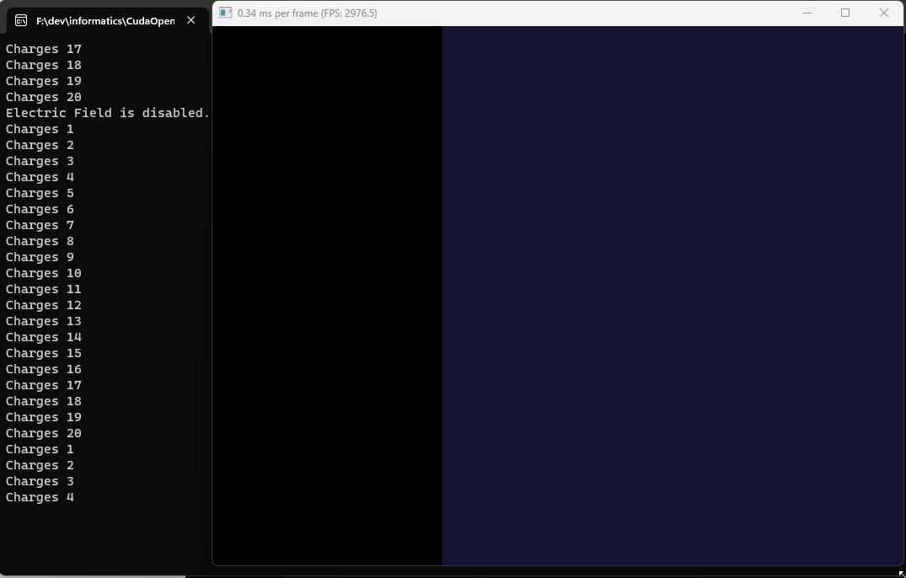

# Electro-magnetic field simulation with CUDA

Press left mouse button to create bunch of particles.
Press right mouse button to create one particle.
Press middle mouse button to clear screen.
Press 'E' keyboard button to toggle electric field.



## Building

Copy library folders to /libs folder.

Create build files:

```sh
cmake -B build
```

Compile executable:

```sh
cmake --build build --config Release

#or

cmake --build build --config Debug
```
